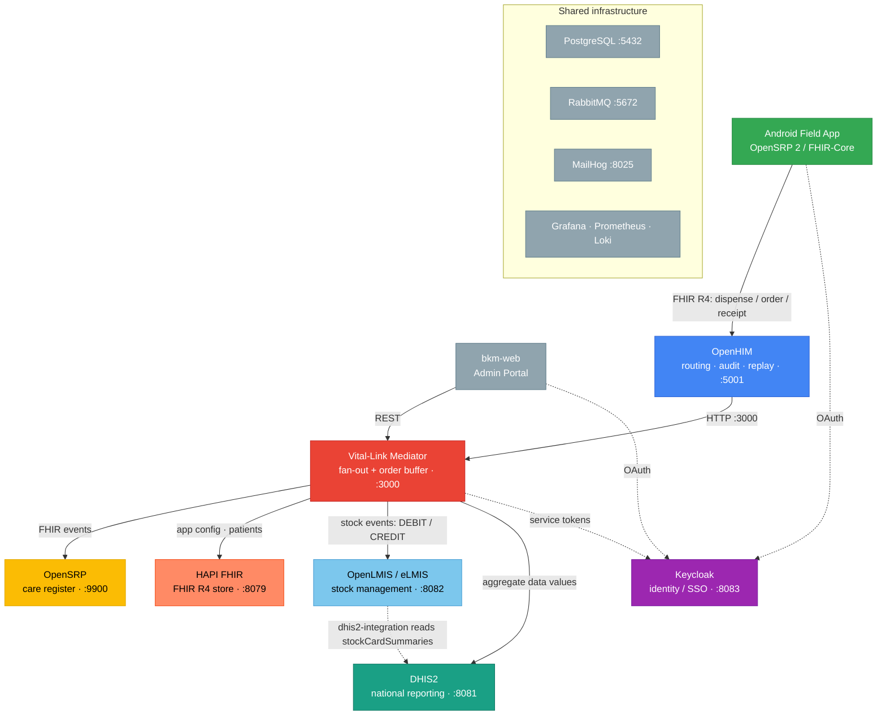

# Lesotho Vital-Link

A Docker Compose sandbox that simulates Lesotho's national health-system integration
stack - the full data flow from a community health worker's Android app through to
national logistics and reporting systems, all over FHIR.

A field worker records a dispense, stock order, or receipt in the OpenSRP / FHIR-Core
Android app. The event flows through OpenHIM to the Vital-Link mediator, which fans it
out to the connected systems and keeps stock and reporting in sync.

## What it integrates

- OpenSRP 2 / FHIR Core - Android field app for community health workers
- HAPI FHIR - FHIR R4 clinical data store
- OpenHIM - integration middleware (channel routing, audit log, transaction replay)
- Vital-Link Mediator - orchestrates the fan-out and the stock lifecycle logic
- OpenLMIS (eLMIS) - logistics and stock management
- DHIS2 - aggregate health data and national reporting
- Keycloak - single sign-on, identity and access management
- bkm-web - admin portal (service status, FHIR browser, stock, user management)
- Grafana / Prometheus / Loki - monitoring, metrics and logs

## Architecture



## Quick start

```bash
make start   # brings up the OpenLMIS + main stacks and seeds them
```

See [docs/](docs/) for architecture and setup, and [docs/architecture.md](docs/architecture.md)
for the full data flow. Contributions: see [CONTRIBUTING.md](CONTRIBUTING.md). Licensed under
Apache 2.0 (see [LICENSE](LICENSE)).
