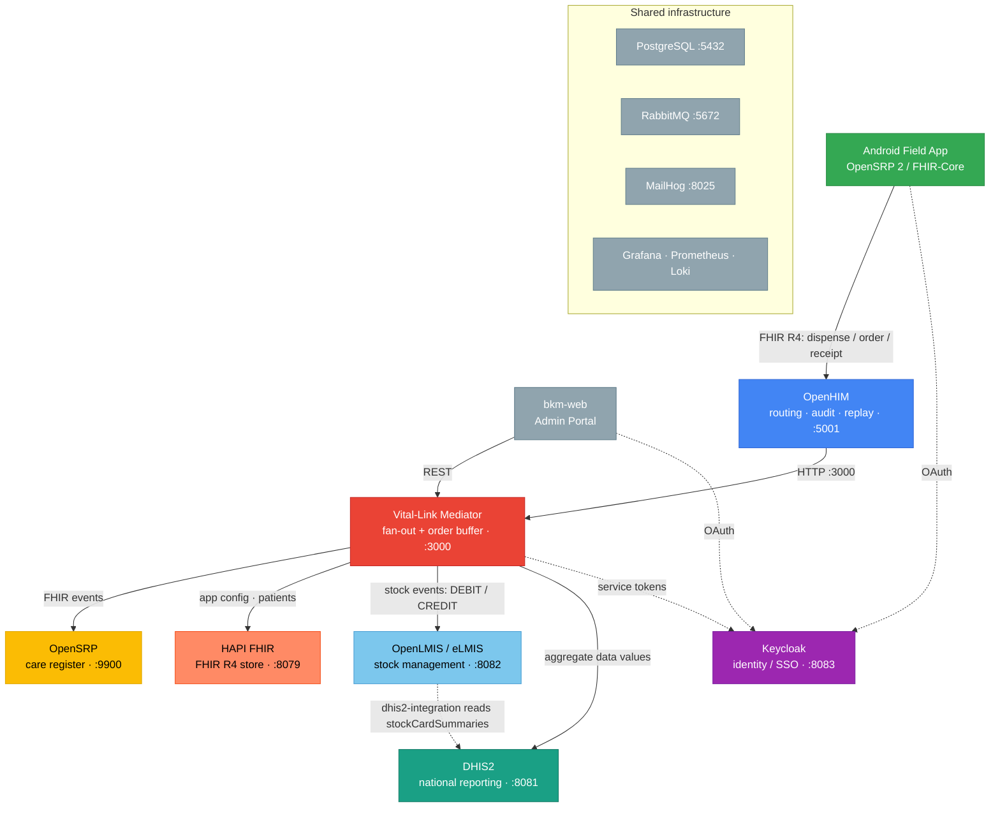

# Lesotho Health System Sandbox — Architecture

## Overview

A Docker Compose sandbox simulating the Lesotho national health system integration stack. Designed for local development and end-to-end testing of the full data flow from an Android field app through to national reporting systems.



Stock order batching (orderBuffer.js): a VHW ORDER is saved to DHIS2 (village org unit,
running monthly total); a Monday 06:00 cron consolidates all villages into a single stock
event to OpenLMIS and marks the period dispatched in `/data/dispatched-orders.json`.

DHIS2 sync: the dhis2-integration service (openlmis/dhis2-integration) reads OpenLMIS
stockCardSummaries on demand. Manual trigger: POST `/mediator-api/dhis2/sync` (the bkm-web
"Sync Now" button on the Services page). Standard 3-indicator pattern: Negative Adjustments /
Positive Adjustments / Closing Balance.

## Services

| Service | Port | Purpose |
|---|---|---|
| openhim-core | 8080 (admin HTTPS), 5001 (client HTTP) | Intercept, audit, route |
| openhim-console | 9000 | OpenHIM web UI |
| bkm-mediator | 3000 (internal) | Fan-out mediator (this repo) |
| dhis2-web | 8081 | DHIS2 national reporting |
| openlmis-nginx | 8082 | OpenLMIS eLMIS (nginx + services) |
| keycloak | 8083 | Identity provider (OpenSRP auth) |
| opensrp-server | 9900 | OpenSRP 2 backend |
| hapi-fhir | 8079 | HAPI FHIR R4 (app config + patient data) |
| health-db-postgres | 5432 | Shared PostgreSQL (all services) |
| openlmis-rabbitmq | 5672 | OpenLMIS internal messaging |
| mailhog | 8025 | SMTP sink (OpenLMIS notifications) |

## Credentials

| System | URL | Username | Password |
|---|---|---|---|
| OpenHIM console | http://localhost:9000 | root@openhim.org | openhim-password |
| DHIS2 | http://localhost:8081 | admin | district |
| OpenLMIS | http://localhost:8082 | admin | password |
| Keycloak admin | http://localhost:8083 | admin | admin |
| Keycloak opensrp realm | — | opensrp-admin | admin |
| PostgreSQL | localhost:5432 | admin | password123 |

## Developer Workflow

```bash
# First time
make start          # docker compose up -d && seed all services (~5-10 min)
make test           # Jest unit tests (no Docker needed)
make smoke          # quick HTTP 200 checks
bash scripts/e2e-test.sh   # full end-to-end test suite (41 tests)

# Reset everything
make reset          # destroy all volumes and restart fresh
```

## Seeded Test Data

All IDs below are stable for the lifetime of a volume set (destroyed on `make reset`):

| Item | System | ID |
|---|---|---|
| Maseru District Clinic A | OpenLMIS facility | `28de536f-b826-4eeb-a3c4-d65221a1120d` |
| Essential Medicines | OpenLMIS program | `31ef5fd8-cef9-4ec0-8304-3018d2cf6c9c` |
| AL 20/120mg | OpenLMIS orderable | `3be1d20f-6aa9-4e52-864f-4fa04aa02056` |
| Consumed (dispense) | OpenLMIS reason | `b5c27da7-bdda-4790-925a-9484c5dfb594` |
| Receipts (receipt) | OpenLMIS reason | `313f2f5f-0c22-4626-8c49-3554ef763de3` |
| Maseru District Clinic A | DHIS2 org unit | `dwx1Yz4BwNX` |
| Ha Mokoena Village (Thabo Mokoena) | DHIS2 org unit | `VilHaMokoe1` |
| Ha Sehlabane Village (Lineo Nthabi) | DHIS2 org unit | `VilHaSehl01` |
| Matsieng Village (Mpho Lerotholi) | DHIS2 org unit | `VilMatsien1` |
| AL 20/120mg (all stock indicators) | DHIS2 data element | `ALStockDE01` |
| Negative Adjustments | DHIS2 category option combo | `oop5xfCVJ01` |
| Positive Adjustments | DHIS2 category option combo | `R988AFoArQU` |
| Closing Balance | DHIS2 category option combo | `E8qivaMehZx` |
| BKM Stock Indicators | DHIS2 category combo | `BKMCatComb1` |
| BKM Stock - AL 20/120mg | DHIS2 dashboard | `BKMStkDsh01` |
| Stock Ordered AL 20/120mg | DHIS2 data element (order buffer) | `DEOrdAL0001` |
| Stock Requested (batch order) | OpenLMIS reason | `ae6be2ea-4a95-4e7e-b8d3-000000000004` |

## Key Architectural Decisions

- **MD5 auth on PostgreSQL** — OpenLMIS JDBC (Java 8 era) rejects SCRAM-SHA-256; `POSTGRES_HOST_AUTH_METHOD=md5` is set cluster-wide.
- **All databases pre-created** — Flyway does not `CREATE DATABASE`; `config/initdb/02-create-databases.sql` pre-creates every service DB with required extensions (PostGIS, uuid-ossp).
- **OpenLMIS referencedata wipes on restart** — `flyway.clean=true` is set; all seeded programs/facilities/orderables must be re-seeded via `seed.sh` after every container restart.
- **OpenHIM channel on port 5001** — the Android app POSTs to the HTTP channel (not 5000 HTTPS) to avoid certificate trust issues in the emulator.
- **consul-template renders nginx config** — OpenLMIS nginx config is generated at runtime; patches must be applied to both the template and the rendered file (see `seed.sh` step 3).

## Key Mediator Modules

| Module | Purpose |
|--------|---------|
| `src/fanout.js` | Fan-out pipeline: OpenSRP + OpenLMIS (DHIS2 delegated to dhis2-integration) |
| `src/routes/dhis2sync.js` | `POST /dhis2/sync` — proxies execute to dhis2-integration service |
| `src/orderBuffer.js` | DHIS2-backed order accumulation + batch dispatch to OpenLMIS |
| `src/routes/questionnaire.js` | Handles RECEIPT / ADJUSTMENT / ORDER QuestionnaireResponse types |
| `src/routes/aggregate.js` | `POST /orders` manual dispatch, `GET /orders` buffer inspect |
| `src/mappings.js` | PERFORMER_MAP with `dhis2OrgUnit` field for per-VHW village routing |

## Further Reading

- [VHW Registration & FHIR Data Model](./vhw-fhir-data-model.md)
- [DHIS2 Visualizations & Dashboards](./dhis2-visualizations.md)
- [OpenHIM Mappings](./openhim-mappings.md)
- [Vital-Link Mediator](../mediator/index.js) — inline JSDoc comments
