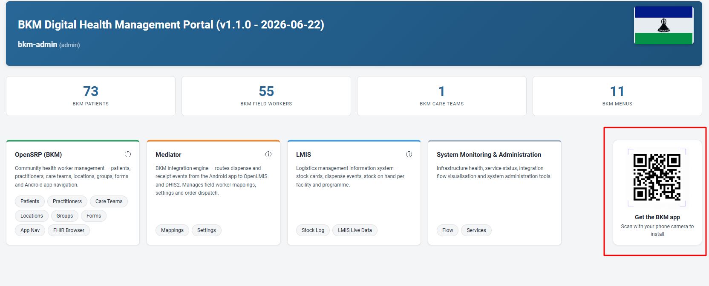

# BKM Mobile App - Authentication and Connectivity (Production)

## Summary

The BKM Android app authenticates directly against Keycloak using OpenID Connect.
There is no proxy or middleware in the login path - the phone talks straight to the
Keycloak server.

## Getting the app

The latest BKM Android app is available from the web portal landing page. Open the portal
(https://lesotho-bkm.xyz) and, on the home page, scan the "Get the BKM app" QR code with
your phone camera to install the current build.

## Identity provider

- Server: https://lesotho-bkm.xyz/auth
- Realm: opensrp
- Issuer: https://lesotho-bkm.xyz/auth/realms/opensrp
- Token endpoint: https://lesotho-bkm.xyz/auth/realms/opensrp/protocol/openid-connect/token
- Client: opensrp-client (public client, Direct Access Grants enabled)
- Grant type: Resource Owner Password Credentials - the user enters username and
  password on the app login screen, and the app exchanges them directly for a token.

## Token lifetimes

- Access token: 5 minutes (the app refreshes automatically while active)
- Refresh / SSO session: 30 minutes of inactivity, after which the user signs in again

## Data flow (what the phone talks to)

- Login / identity: phone to Keycloak (lesotho-bkm.xyz/auth) - direct
- Clinical data (patients, dispenses): phone to FHIR server
  (https://fhir.lesotho-bkm.xyz/fhir) - direct, using the Keycloak token as a bearer token
- Downstream integration (OpenLMIS stock, DHIS2 reporting, per-VHW allocation): handled
  server-side - the integration service reads new records from the FHIR server. The phone
  never connects to it.

## Network requirements (for a device to work)

- Outbound HTTPS (443) to lesotho-bkm.xyz (Keycloak) and fhir.lesotho-bkm.xyz (FHIR)
- Valid TLS certificates on both hosts (already in place)

## Keycloak configuration that must remain in place

- Realm opensrp with client opensrp-client present and enabled
- Direct Access Grants enabled on opensrp-client
- Users assigned the appropriate workflow role (e.g. vhw)
- The realm issuer URL must stay constant - the FHIR server validates that tokens are
  issued by https://lesotho-bkm.xyz/auth/realms/opensrp

## Implication for a customer-hosted Keycloak

To point the app at a different Keycloak (e.g. the Ministry's own), only two build values
change: the OAuth base URL (realm) and the client ID. The target realm must contain the
opensrp-client client (public, direct access grants on) and the same workflow roles. No
app code change is required.
